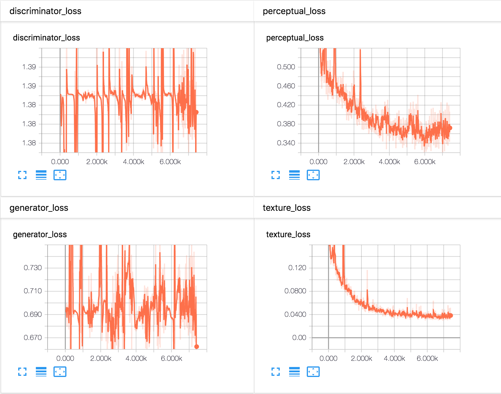
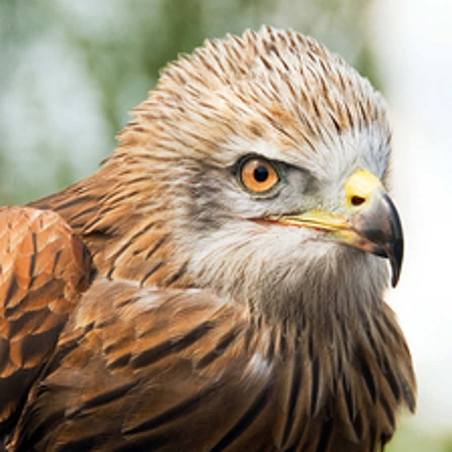
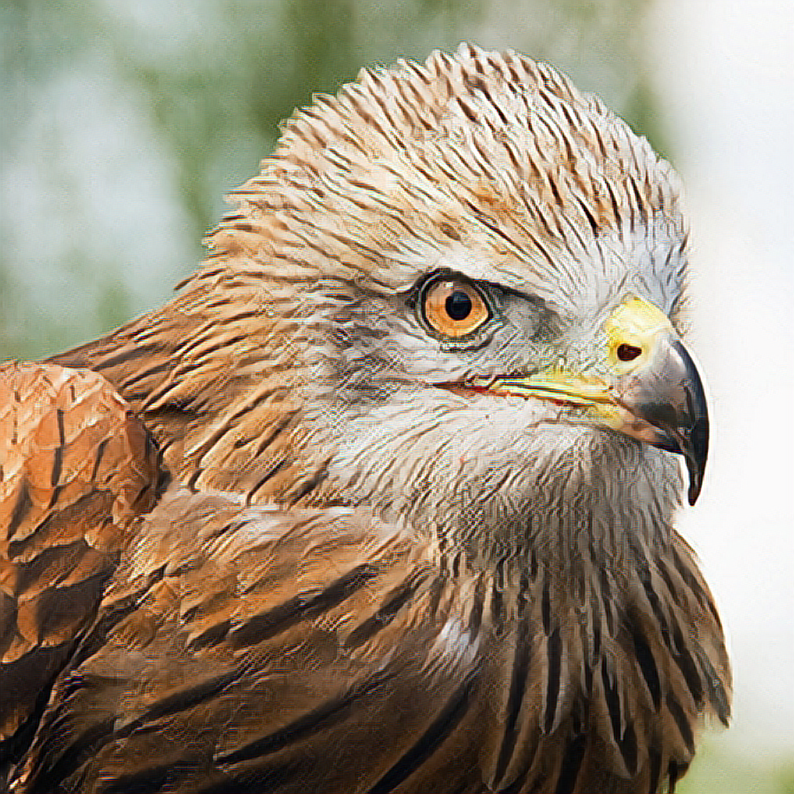
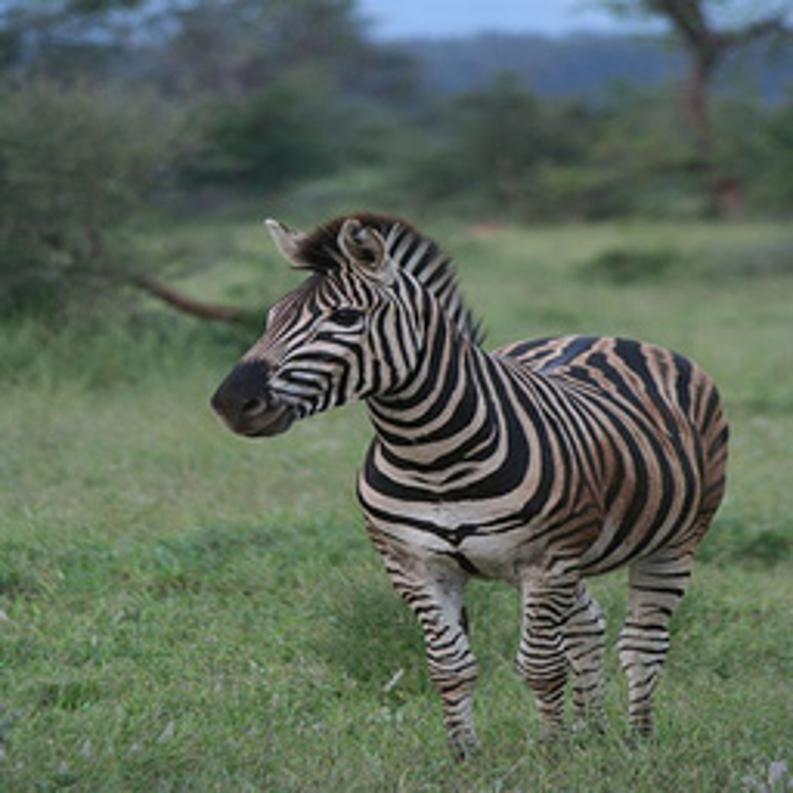
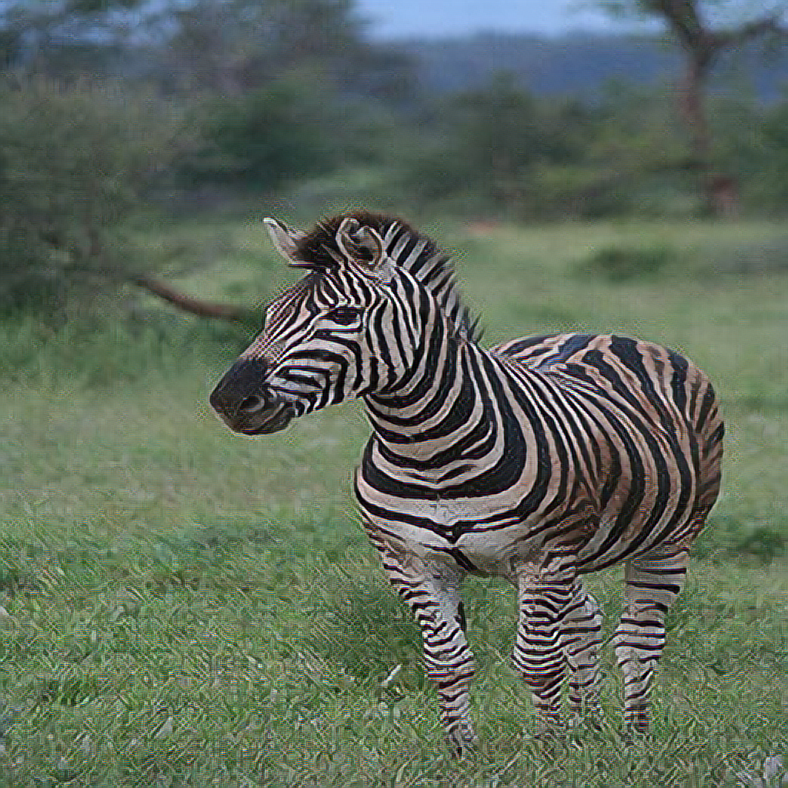
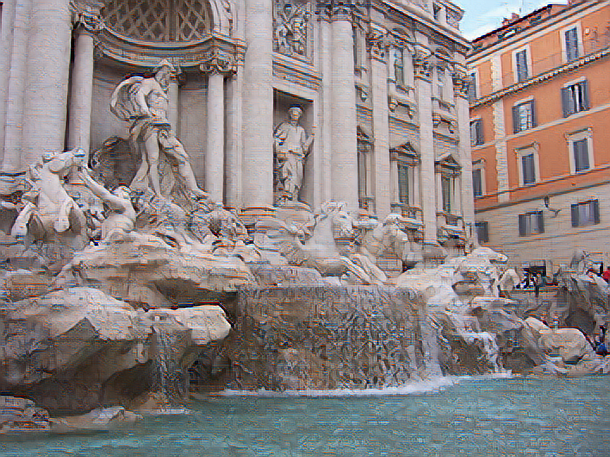
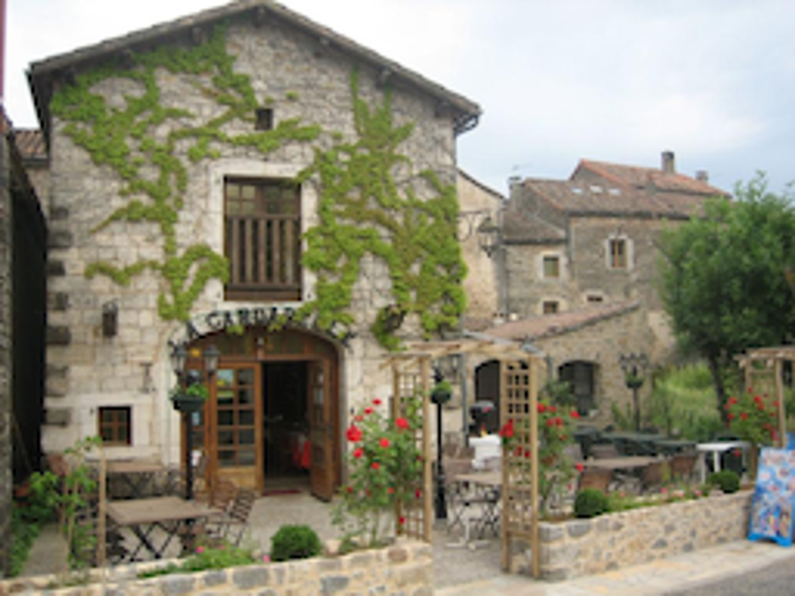

# Replicate "EnhanceNet: Single Image Super-Resolution Through Automated Texture Synthesis"

[arXiv: EnhanceNet: Single Image Super-Resolution Through Automated Texture Synthesis](https://arxiv.org/abs/1612.07919)

## Requirements

- numpy
- pillow
- scipy
- tensorflow

## Training (ENet-PAT)

The entire model was trained on Google Cloud Machine Learning Engine (standard_p100, which is a single NVIDIA Tesla P100 GPU).

* **train_dir_path** : path to the directory of training data (images which is RGB and with size larger than 128x128). can be on google cloud storage.
* **vgg19_path** : path to the vgg19 weights file. can be on google cloud storage.
* **ckpt_path** : path to the directory for saving checkpoints. can be on google cloud storage.
* **log_path** : path to the directory for saving log. can be on google cloud storage.
* **model** : ENet-PAT.
    - if model string contains 'a', add GAN networks and losses.
    - if model string contains 't', add texture loss.
* **batch_size** : batch size of both generator & discriminator.

```
gcloud ml-engine jobs submit training $(NAME_JOB) \
    --module-name enet.experiment_train \
    --package-path enet \
    --python-version=3.5 \
    --staging-bucket gs://hecate-research-ml-staging/ \
    --region asia-east1 \
    --runtime-version=1.8 \
    --scale-tier=CUSTOM \
    --config=config.yaml \
    -- \
    --train_dir_path=gs://hecate-research-datasets/mscoco2014/train2014_256x256/ \
    --vgg19_path=gs://hecate-research-model-weights/vgg19_weights_tf_dim_ordering_tf_kernels_notop.npz \
    --ckpt_path=$(PATH_CHECKPOINT) \
    --log_path=$(PATH_LOG) \
    --model=$(MODEL)
```

## Extract & Freeze Generator Graph

The training checkpoints contain un-necessary contents for super-resolution:
* discriminator
* vgg-19
* all variables (freeze_graph replace them with constants)

* **extract_model** : do extracting model work.
* **source_ckpt_path** : path to a checkpoint.
* **target_ckpt_path** : path to a directory to keep extracted model and weights.

```
python -m enet.experiment_resolve \
    --extract_model \
    --source_ckpt_path=./ckpt/model.ckpt-5999 \
    --target_ckpt_path=./frozen/

freeze_graph --input_graph=./frozen/graph.pbtxt \
    --input_checkpoint=./frozen/model.ckpt \
    --output_graph=./frozen/frozen.pb \
    --output_node_names=sd_images,bq_images,sr_images
```

## Testing

Super-resolve all images in source_dir_path and output their bicubic & super-resolved versions to target_dir_path.

* **graph_define_path** : path to the frozen weights and graph.
* **source_dir_path** : path to a directory where keeps all the images for super resolving.
* **target_dir_path** : path to a directory to keep all bicubic & super resolved results.

```
python -m enet.experiment_resolve \
    --graph_define_path=./ckpt/frozen/frozen.pb \
    --source_dir_path=./img_in \
    --target_dir_path=./img_out
```

---

## Note

- Trained on Google Cloud Machine Learning Engine.
- Training is very slow. The entire model is composed with 3 sub networks.
    * Generator and discriminator for GAN loss.
    * The generator contains 10 residual blocks.
    * VGG-19 for texture and perceptual losses. Both super-resolved & ground-truth images must be fed to VGG-19.

## Results

- Trained with [Common Objects in Context, 2014](http://cocodataset.org/)

---

All results are displayed in order ground-truth/bicubic/enet-pat.

During training:




Eagle ([ENet Paper](https://webdav.tue.mpg.de/pixel/enhancenet/))





Zebra ([ImageNet](http://www.image-net.org/))





Trevi Fountain(SunHays100)




AUBERGE LA CARDABELLE(SunHays100)




