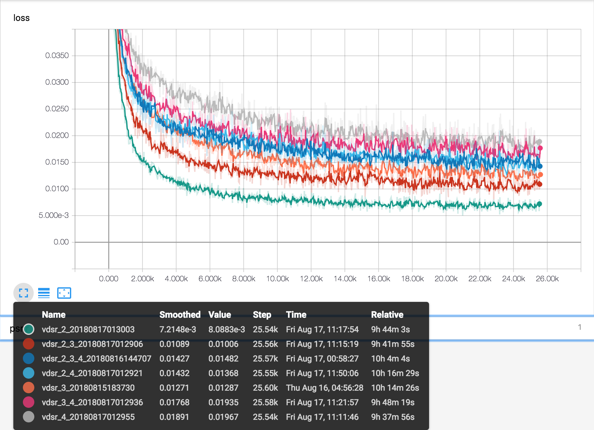
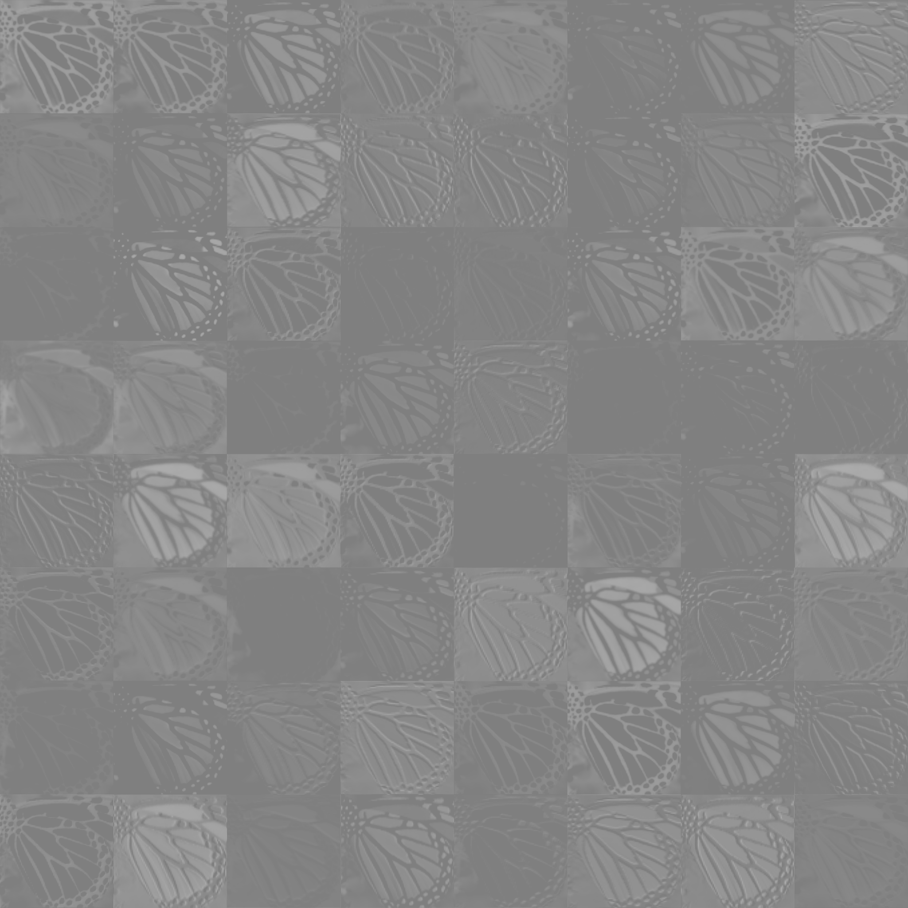
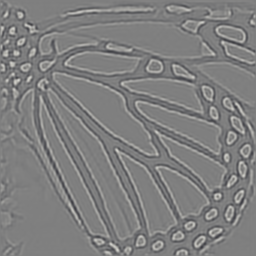
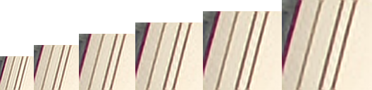
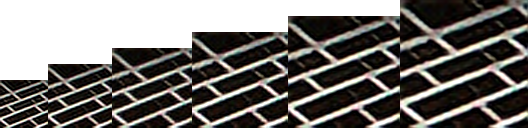
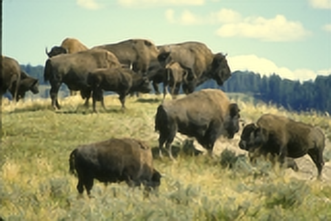

# Replicate "Accurate Image Super-Resolution Using Very Deep Convolutional Networks"

[arXiv: Accurate Image Super-Resolution Using Very Deep Convolutional Networks](https://arxiv.org/abs/1511.04587)

## Requirements

* numpy
* pillow
* scikit-image
* tensorflow

## Training

The entire model was trained on Google Cloud Machine Learning Engine (standard_p100, which is a single NVIDIA Tesla P100 GPU).

Momentum optimizer & gradient clipping are implemented but not tested.

* **data_path** : path to a directory which contains all image training data.
* **ckpt_path** : path to a directory for keeping the checkpoint.
* **logs_path** : path to a directory for keeping log.
* **scaling_factors** : different scaling factors for training, separated by _ (e.g. 2_3_4).
* **image_size** : random crop training images to this size as network inputs.
* **batch_size** : size of each batch during training.
* **num_layers** : number of hidden layers.
* **learning_rate_decay_steps** : decrease learning rate every k steps.
* **learning_rate_decay_factor** : decrease learning rate by factor.
* **initial_learning_rate** : initial learning rate value.
* **stop_training_at_k_step** : stop training at k step, default is stop after 80 epochs.
* **use_adam** : use adam instead of momentum optimizer (always on in my test).

```
gcloud ml-engine jobs submit training $(NAME_JOB) \
    --module-name vdsr.experiment_train \
    --package-path vdsr \
    --python-version=3.5 \
    --staging-bucket gs://hecate-research-ml-staging/ \
    --region asia-east1 \
    --runtime-version=1.8 \
    --scale-tier=CUSTOM \
    --config=config.yaml \
    -- \
    --ckpt_path=$(PATH_CHECKPOINT) \
    --logs_path=$(PATH_LOG) \
    --data_path=gs://hecate-research-datasets/vdsr_291/291/ \
    --scaling_factors=2_3_4 \
    --stop_training_at_k_step=25600 \
    --image_size=128 \
    --batch_size=64 \
    --num_layers=20 \
    --use_adam \
    --initial_learning_rate=0.00005 \
    --learning_rate_decay_steps=2560 \
    --learning_rate_decay_factor=0.9
```

## Feature Map Visualization

Visualize each layer (Figure 2).

* **meta_path** : path to the graph.
* **ckpt_path** : path to the weights.
* **hd_image_path** : path to the hd image for this experiment.
* **result_dir_path** : path to a directory for keeping results.
* **scaling_factor** : scaling factor for this experiment.


## Super Resolve

Super resolve the input image.

* **meta_path** : path to the graph.
* **ckpt_path** : path to the weights.
* **ground_truth_mode** : simulate sd image (true) or super-resolve directly from the input image.
* **hd_image_path** : path to the image of super resolving source.
* **sr_image_path** : path to the image of super resolved result.
* **scaling_factor** : scaling factor for this experiment.

```
python -m vdsr.experiment_resolve \
    --meta_path=gs://hecate-research-ml-results/ckpt_vdsr/vdsr_2_3_4_20180816144707/model.ckpt-25600.meta \
    --ckpt_path=gs://hecate-research-ml-results/ckpt_vdsr/vdsr_2_3_4_20180816144707/model.ckpt-25600 \
    --ground_truth_mode=True \
    --hd_image_path=gs://hecate-research-datasets/BSDS300/images/test/148026.jpg \
    --sr_image_path=./sr/sr_234_3_148026.png \
    --scaling_factor=3.0
```

## Evaluate

Get PSNR/SSIM of Bicubic & super resolved results.

* **meta_path** : path to the graph.
* **ckpt_path** : path to the weights.
* **hd_image_dir_path** : path to a dir contains hd images.
* **scaling_factor** : scaling factor for this experiment.

## Notes

* Did not use the same optimizer as the paper (momentum & gradient clipping).
* Did not get results as good as paper's (different optimizer, different scaling methods).

## Results

### Training



x2


x3


x4


x2,3


x2,4


x3,4


x2,3,4


### Table 2

The results are different from paper's. However the values present the same scenarios (e.g. PSNR of testing images are higher if the training data contains the associated versions).


| Test/Train | x2    | x3    | x4    | x2,3  | x2,4  | x3,4  | x2,3,4 | Bicubic |
|------------|-------|-------|-------|-------|-------|-------|--------|---------|
| x2         | 33.75 | 28.08 | 23.30 | 32.82 | 32.08 | 28.84 | 32.50  | 29.93   |
| x3         | 28.05 | 30.05 | 26.25 | 29.95 | 28.70 | 29.77 | 29.83  | 27.30   |
| x4         | 25.64 | 26.64 | 28.12 | 26.38 | 28.00 | 27.97 | 27.93  | 25.24   |

### Table 3

| Dataset  | Scale | Bicubic      | VDSR         |
|----------|-------|--------------|--------------|
|          |       | PSNR/SSIM    | PSNR/SSIM    |
| Set5     | x2    | 29.93/0.8682 | 33.75/0.9284 |
|          | x3    | 27.30/0.7850 | 30.05/0.8649 |
|          | x4    | 25.24/0.6985 | 28.12/0.8064 |
| Set14    | x2    | 27.02/0.7902 | 29.66/0.8685 |
|          | x3    | 24.88/0.6874 | 26.68/0.7683 |
|          | x4    | 23.32/0.5968 | 25.22/0.6920 |
| B100     | x2    | 27.46/0.7921 | 28.66/0.8557 |
|          | x3    | 25.22/0.6677 | 26.65/0.7533 |
|          | x4    | 23.94/0.5812 | 25.34/0.6698 |
| Urban100 | x2    | 24.27/0.7691 | 27.16/0.8679 |
|          | x3    | 22.26/0.6544 | 24.17/0.7565 |
|          | x4    | 20.92/0.5627 | 22.71/0.6733 |

### Figure 2


Conv.1



Relu.1


Conv.20



[conv 1](../assets/vdsr-fig2-conv.1.png), [conv 2](../assets/vdsr-fig2-conv.2.png), [conv 3](../assets/vdsr-fig2-conv.3.png), [conv 4](../assets/vdsr-fig2-conv.4.png), [conv 5](../assets/vdsr-fig2-conv.5.png), [conv 6](../assets/vdsr-fig2-conv.6.png), [conv 7](../assets/vdsr-fig2-conv.7.png), [conv 8](../assets/vdsr-fig2-conv.8.png), [conv 9](../assets/vdsr-fig2-conv.9.png), [conv 10](../assets/vdsr-fig2-conv.10.png), [conv 11](../assets/vdsr-fig2-conv.11.png), [conv 12](../assets/vdsr-fig2-conv.12.png), [conv 13](../assets/vdsr-fig2-conv.13.png), [conv 14](../assets/vdsr-fig2-conv.14.png), [conv 15](../assets/vdsr-fig2-conv.15.png), [conv 16](../assets/vdsr-fig2-conv.16.png), [conv 17](../assets/vdsr-fig2-conv.17.png), [conv 18](../assets/vdsr-fig2-conv.18.png), [conv 19](../assets/vdsr-fig2-conv.19.png), [conv 20](../assets/vdsr-fig2-conv.20.png)

[relu 1](../assets/vdsr-fig2-relu.1.png), [relu 2](../assets/vdsr-fig2-relu.2.png), [relu 3](../assets/vdsr-fig2-relu.3.png), [relu 4](../assets/vdsr-fig2-relu.4.png), [relu 5](../assets/vdsr-fig2-relu.5.png), [relu 6](../assets/vdsr-fig2-relu.6.png), [relu 7](../assets/vdsr-fig2-relu.7.png), [relu 8](../assets/vdsr-fig2-relu.8.png), [relu 9](../assets/vdsr-fig2-relu.9.png), [relu 10](../assets/vdsr-fig2-relu.10.png), [relu 11](../assets/vdsr-fig2-relu.11.png), [relu 12](../assets/vdsr-fig2-relu.12.png), [relu 13](../assets/vdsr-fig2-relu.13.png), [relu 14](../assets/vdsr-fig2-relu.14.png), [relu 15](../assets/vdsr-fig2-relu.15.png), [relu 16](../assets/vdsr-fig2-relu.16.png), [relu 17](../assets/vdsr-fig2-relu.17.png), [relu 18](../assets/vdsr-fig2-relu.18.png), [relu 19](../assets/vdsr-fig2-relu.19.png)

### Figure 5

| Scale | Bicubic (PSNR/SSIM) | VDSR (PSNR/SSIM) |
|-------|---------------------|------------------|
| x1.5  | 27.27 / 0.9016      | 26.40 / 0.8898   |
| x2    | 24.77 / 0.8201      | 26.72 / 0.8902   |
| x2.5  | 23.62 / 0.7674      | 25.14 / 0.8426   |
| x3    | 22.66 / 0.7121      | 24.16 / 0.8016   |
| x3.5  | 21.95 / 0.6664      | 23.26 / 0.7608   |
| x4    | 21.36 / 0.6264      | 22.72 / 0.7198   |



| Scale | Bicubic (PSNR/SSIM) | VDSR (PSNR/SSIM) |
|-------|---------------------|------------------|
| x1.5  | 22.54 / 0.8506      | 22.82 / 0.8455   |
| x2    | 20.09 / 0.7397      | 22.12 / 0.8296   |
| x2.5  | 19.07 / 0.6791      | 20.71 / 0.7740   |
| x3    | 18.20 / 0.6199      | 19.91 / 0.7324   |
| x3.5  | 17.51 / 0.5723      | 19.25 / 0.6961   |
| x4    | 16.95 / 0.5328      | 18.59 / 0.6538   |



## Figure 6 (B100 148026)

Not good.

|      | Bicubic        | VDSR           |
|------|----------------|----------------|
| PSNR | 20.0855731964  | 21.4757270813  |
| SSIM | 0.553097963333 | 0.692859172821 |


## Figure 7 (B100 38092)

Not good.

|      | Bicubic       | VDSR          |
|------|---------------|---------------|
| PSNR | 24.4878997803 | 25.4842681885 |
| SSIM | 0.64012748003 | 0.72020894289 |



## Datasets

* Set5: [Low-Complexity Single-Image Super-Resolution based on Nonnegative Neighbor Embedding](http://people.rennes.inria.fr/Aline.Roumy/results/SR_BMVC12.html)
* Set14: [On Single Image Scale-Up using Sparse-Representations](https://sites.google.com/site/romanzeyde/research-interests)
* B100: [BSDS300 Test](https://www2.eecs.berkeley.edu/Research/Projects/CS/vision/bsds/)
* Urban 100: (Single Image Super-Resolution from Transformed Self-Exemplars)[https://sites.google.com/site/jbhuang0604/publications/struct_sr]
